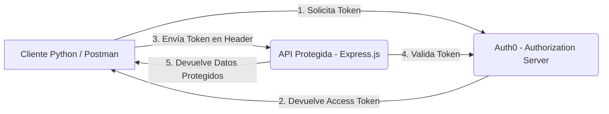

# Implementación de OAuth 2.0 con Client Credentials y Refresh Token
Asignatura: Patrones Arquitectonicos. \
Integrantes del grupo: Laura Camila Rodriguez León, Mariana Valle Moreno, Valentina Alejandra Lopez Romero.

## 1. Introducción

El presente trabajo implementa un sistema de autenticación y autorización basado en el estándar OAuth 2.0, utilizando Auth0 como Authorization Server y Node.js con Express.js como entorno de desarrollo para el Resource Server (API protegida).

En la implementación se desarrollaron dos flujos principales del protocolo:

- Client Credentials Grant: empleado para la comunicación entre microservicios o clientes de servidor a servidor.

- Authorization Code con **Refresh Token**: destinado a la autenticación y autorización de usuarios finales, permitiendo mantener sesiones activas sin reautenticación manual.

El propósito es garantizar el acceso seguro a los recursos de una API protegida mediante la validación de tokens emitidos por Auth0, asegurando el cumplimiento de buenas prácticas en materia de seguridad, gestión de identidad y control de acceso.

---

## 2. Objetivos

- Implementar los flujos Client Credentials y Authorization Code con Refresh Token en un entorno funcional y seguro.
- Configurar un servidor de autorización (Auth0) que emita, valide y renueve tokens de acceso.
- Proteger una API REST desarrollada en Express.js mediante verificación de tokens JWT.
- Validar el funcionamiento completo de los flujos y la protección del API mediante pruebas en Postman.
- Aplicar principios de separación de responsabilidades y seguridad arquitectónica en la comunicación entre servicios.

---

## 3. Arquitectura del Sistema

La siguiente arquitectura se basa en el patrón Authorization Server + Resource Server, separando completamente las responsabilidades de autenticación (Auth0) y autorización de recursos (Express.js).



---

## 4. Configuración del Authorization Server (Auth0)

### **Paso 1:** Creación del Tenant
Se configuró un tenant en Auth0 bajo dominio seguro HTTPS.  
Se habilitaron los flujos *Client Credentials* y *Authorization Code* con soporte para *Refresh Tokens*.

### **Paso 2:** Aplicaciones Registradas
- **Machine-to-Machine Application:** destinada al flujo *Client Credentials*, utilizada por microservicios o scripts automatizados.  
  - Scopes: `service.read`, `service.write`.  
- **Regular Web Application:** diseñada para usuarios finales en el flujo *Authorization Code + Refresh Token*.  
  - Scopes: `user.read`, `user.write`.

### **Paso 3:** Definición de la API
Se registró una API protegida con el **identifier** `https://parcial-api`, configurada para emitir tokens JWT firmados con el algoritmo **RS256**.

### **Paso 4:** Scopes y Roles
Los permisos se definieron por tipo de cliente:
- Microservicios → `service.read` y `service.write`.  
- Usuarios finales → `user.read` y `user.write`.

Estos scopes fueron utilizados en la validación de las rutas protegidas dentro del API Express.

### **Paso 5:** Flujo Client Credentials
**Propósito:** permitir que un microservicio obtenga un `access_token` sin credenciales de usuario.  
**Archivo:** `flujo_Client_Credentials.py`

**Proceso:**
1. El cliente realiza una solicitud `POST` al endpoint `/oauth/token` de Auth0 con los parámetros:
   - `grant_type=client_credentials`  
   - `client_id` y `client_secret`  
   - `audience=https://parcial-api`  
2. Auth0 responde con un `access_token` (JWT) de validez limitada.  
3. El microservicio incluye el token en las peticiones al servidor Express mediante:  
   `Authorization: Bearer <access_token>`  
4. El servidor valida el token y, de ser válido, devuelve los datos protegidos.

### **Paso 6:** Flujo Authorization Code con Refresh Token
**Propósito:** permitir autenticación de usuarios y renovación de sesión.

**Proceso:**
1. El usuario accede a la URL de autorización e inicia sesión mediante Auth0.  
2. Auth0 devuelve un `authorization_code`.  
3. El cliente intercambia el código por un `access_token` y un `refresh_token`.  
4. El usuario accede a la API protegida con el `access_token`.  
5. Al expirar, el `refresh_token` permite obtener un nuevo `access_token` sin requerir login nuevamente.

---

## 5. Validación en la API Protegida (Express.js)

**Archivo:** `api/server.js`

El servidor Express implementa middlewares de Auth0 para validar los tokens:

1. Usa middleware de Auth0 (express-jwt o jsonwebtoken) para verificar firma y audiencia.
2. Solo las peticiones con un token válido pueden acceder a los endpoints.
3. Si el token es inválido o ha expirado, responde con código 401 Unauthorized.

```js
const checkJwt = jwt({
  secret: jwksRsa.expressJwtSecret({
    cache: true,
    rateLimit: true,
    jwksUri: `https://authparcial.us.auth0.com/.well-known/jwks.json`
  }),
  audience: "https://parcial-api",
  issuer: "https://authparcial.us.auth0.com/",
  algorithms: ["RS256"]
});
```

Cada endpoint protegido exige un scope o permiso específico:

app.get("/user", checkJwt, checkScopes("user.read"), (req, res) => {
  res.json({ msg: "Accediste con user.read" });
});

app.post("/user", checkJwt, checkScopes("user.write"), (req, res) => {
  res.json({ msg: "Accediste con user.write" });
});


Solo las peticiones con un token válido pueden acceder a estos endpoints, mientras que las solicitudes no autorizadas reciben una respuesta 403 Insufficient scope

## 5. Pruebas (Postman)

- Generación de tokens
BODY:\


Resultado obtenido:


- Regeneración de tokens después de su expiración:
URL UTILIZADA: *https://authparcial.us.auth0.com/authorize?response_type=code&client_id=Xw0nloJVNlxac6eBNnlLnPiFJEg2pA7Y&redirect_uri=http://localhost:3000/callback&scope=openid profile email user.read user.write offline_access&audience=https://parcial-api*

BODY: \


Resultado obtenido:


- Verificación de la seguridad: Utilizando el token generado para los scopes user.read y user.write.


- Uso de user.read:


- Uso de GET /service con el token correcto:


## 6. Resultados Esperados

| Flujo | Descripción | Resultado |
|-------|--------------|-----------|
| **Client Credentials** | Permite que un microservicio obtenga un `access_token` directamente desde Auth0 sin intervención de usuario, garantizando comunicación segura entre servicios. | Logrado |
| **Authorization Code + Refresh Token** | Facilita la autenticación de usuarios finales y la renovación automática del `access_token` mediante el uso del `refresh_token`, evitando el reingreso de credenciales. | Logrado |
| **API Protegida (Express.js)** | Valida la firma, audiencia y scopes de los tokens emitidos por Auth0, respondiendo únicamente a peticiones autenticadas y autorizadas. | Logrado |


## 7. Conclusiones

- Separación de responsabilidades: La arquitectura distingue de forma clara entre autenticación (Auth0) y autorización (API Express), reduciendo la complejidad y mejorando la seguridad.

- Cumplimiento de buenas prácticas: Los flujos implementados siguen las recomendaciones oficiales del estándar OAuth 2.0, asegurando protección ante accesos no autorizados.

- Escalabilidad y extensibilidad: El uso de Auth0 permite gestionar usuarios, roles y permisos de forma centralizada, facilitando la ampliación del sistema a futuros servicios.

- Gestión segura de tokens: Se garantiza la validez temporal de los access_token y la renovación automática mediante refresh_token, optimizando la experiencia de usuario.

- Aplicabilidad arquitectónica: El proyecto ejemplifica un patrón Authorization Server + Resource Server, ampliamente utilizado en arquitecturas orientadas a servicios y microservicios modernos.
