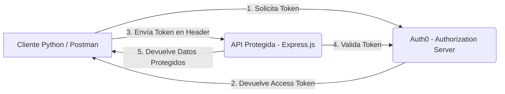

# Implementación de OAuth 2.0 con Client Credentials y Refresh Token
Asignatura: Patrones Arquitectonicos. \
Integrantes del grupo: Laura Camila Rodriguez León, Mariana Valle Moreno, Valentina Alejandra Lopez Romero.

## 1. Introducción

El presente trabajo implementa un sistema de autenticación y autorización basado en el estándar OAuth 2.0, utilizando Auth0 como el **Authorization Server**.  
Se desarrolaron dos flujos principales:

- **Client Credentials Grant**: el cual fue empleado para la comunicación entre microservicios.
- **Authorization Code con Refresh Token**: utilizado por aplicaciones cliente que representan los usuarios finales.

El propósito esperado es lograr garantizar el acceso seguro a una API protegida, permitiendo así la validación de tokens y la renovación de sesiones sin reautenticación, según las buenas prácticas de seguridad y a los lineamientos del protocolo OAuth 2.0.

---

## 2. Objetivos

- Implementar los flujos Client Credentials y Authorization con Refresh Token en un entorno funcional.
- Configurar un Authorization Server (Auth0) que gestione la emisión y validación de tokens.
- Proteger un API REST en Express.js que valide los `access_token` antes de autorizar el acceso.
- Demostrar mediante Postman el funcionamiento de los flujos y la protección del API.

---

## 3. Arquitectura del Sistema

---

## 4. Configuración del Authorization Server (Auth0)

### **Paso 1:** Creación de Tenant en Auth0

- Se configuró un nuevo tenant con dominios HTTPS.
- Se habilitaron los flujos Client Credentials y Authorization Code + Refresh Token.

###**Paso 2:** Aplicaciones Registradas

Machine-to-Machine Application: usada por el cliente Python para el flujo Client Credentials.
 - Scopes: service.read, service.write.
SPA / Web Application: usada para el flujo de usuario final con Refresh Token.
 - Scopes: user.read, user.write.

### **Paso 3:** Definición de APIs

Se registra una API protegida en Auth0 (audience).
El API usa JWTs emitidos por Auth0 y firmados con algoritmo RS256.

### **Paso 4:** Configuración de Scopes y Roles

Se definen permisos granulares según tipo de flujo:
 - Microservicios → service.*
 - Usuarios → user.*

## **Paso 5:** Flujo Client Credentials

Este flujo permite que un microservicio cliente obtenga un access_token directamente desde Auth0 sin credenciales de usuario.

**Archivo:** flujo_Client_Credentials.py

**Proceso:**
1. El cliente envía una solicitud POST al endpoint /oauth/token de Auth0 con:
- grant_type=client_credentials
- client_id y client_secret
. audience del API
2. Auth0 responde con un access_token (JWT) con tiempo de expiración limitado.
3. El cliente usa el token en el encabezado para consumir el API protegido en server.js.:
  *Authorization: Bearer <access_token>*
4. La API valida el token usando la librería JWT de Auth0 y, si es válido, responde con los datos solicitados.

### **Paso 5:** Flujo Authorization Code con Refresh Token

Este flujo se utiliza para usuarios finales (frontend o Postman).

**Proceso:**

1. El usuario inicia sesión en Auth0 y autoriza la aplicación.
2. Auth0 emite un access_token y un refresh_token.
3. El cliente usa el access_token para acceder al API.
4. Cuando el token expira, el cliente solicita uno nuevo enviando:\
  *grant_type=refresh_token* \
  *refresh_token=<token_anterior>*
5. Auth0 responde con un nuevo access_token, manteniendo la sesión sin reautenticación.

## **Paso 6:** Validación del Token en la API Protegida

**Archivo:** api/server.js

El servidor Express valida los tokens recibidos en cada request:
1. Usa middleware de Auth0 (express-jwt o jsonwebtoken) para verificar firma y audiencia.
2. Solo las peticiones con un token válido pueden acceder a los endpoints.
3. Si el token es inválido o ha expirado, responde con código 401 Unauthorized.
  *app.get('/data', checkJwt, (req, res) => {
    res.json({ message: 'Acceso autorizado al recurso protegido.' });
  });*

## **Paso 7:** Seguridad y HTTPS

- Todo el tráfico entre cliente, Auth0 y API debe realizarse sobre HTTPS.
- Los client_secret se manejan únicamente del lado del servidor.
- Los tokens se transmiten exclusivamente por el encabezado Authorization.
- El servidor implementa CORS seguro y cabeceras de protección (helmet).

## **Paso 8:** Pruebas (Postman)

## **Paso 9:** Resultados Esperados

* Client Credentials: el microservicio obtiene y usa correctamente un access_token.
* Refresh Token: el usuario renueva su sesión sin autenticarse de nuevo.
* API Protegida: responde solo ante tokens válidos emitidos por Auth0.

## **Paso 10:** Conclusiones

